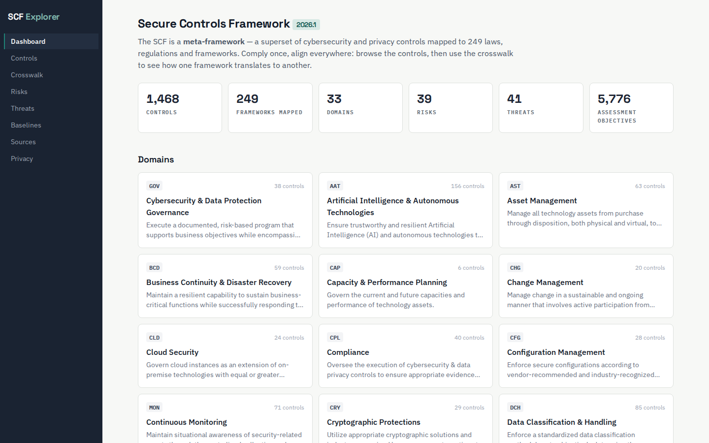
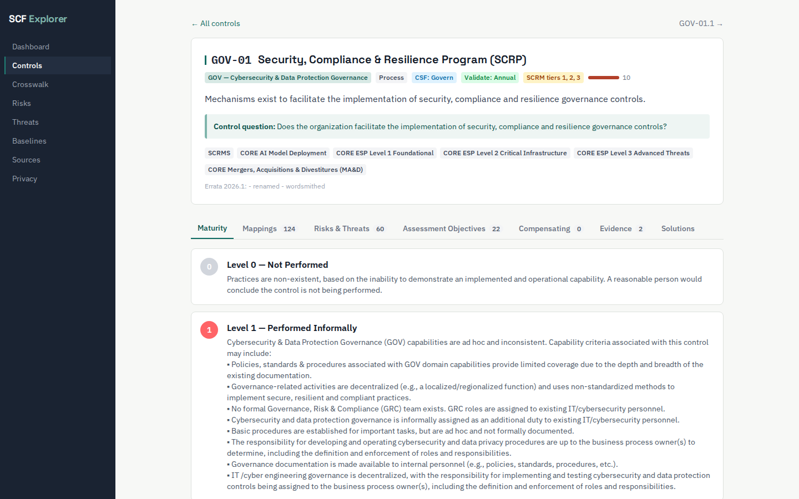
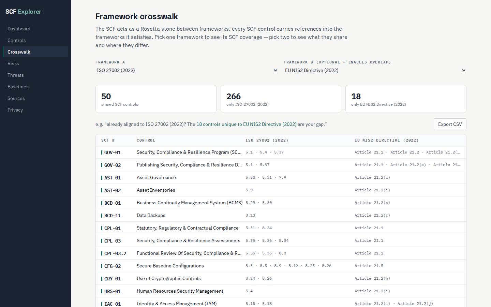

# SCF Explorer

A read-only, feature-rich web viewer for the [Secure Controls Framework](https://securecontrolsframework.com) (SCF) — the free meta-framework of 1,400+ cybersecurity, privacy and resilience controls mapped to ~250 laws, regulations and frameworks.

Upload the official SCF Excel workbook and browse everything it contains in a fast, beautiful interface. **Everything runs in your browser — the workbook is parsed client-side and never leaves your machine.**



## Why

The SCF's genius is that it is a *meta-framework*: satisfy an SCF control once, and you can show alignment to every framework it maps to. But the official distribution is a 369-column spreadsheet — extraordinary content, hard to explore. SCF Explorer turns that spreadsheet into a browsable library, so teams can see what meta-framework thinking actually buys them.

## Features

- **Controls browser** — faceted filtering (domain, PPTDF, NIST CSF function, baseline, weighting, "mapped to framework X") with instant full-text search across 1,468 controls, virtualized for speed, CSV export.
- **Control detail** — per-control maturity criteria (SCR-CMM levels 0–5), all framework mappings grouped by geography, linked risks and threats with full catalog text, assessment objectives with rigor levels, compensating controls, evidence artifact references, and solution guidance by organisation size.

  

- **Framework crosswalk** — pick one framework for its SCF coverage map; pick two for an overlap analysis using the SCF as a Rosetta stone ("already aligned to ISO 27002? Here is exactly what NIS2 adds"). CSV export for both.

  

- **Risk & threat catalogs** — the SCF's 39 risks and 41 threats, each linked both ways to controls.
- **Baselines & sources** — SCF CORE baseline subsets and the full authoritative-sources directory with source and STRM links.
- **Privacy principles** — the SCF-DPMP principle set with its control and privacy-framework mappings.
- **Version-tolerant parser** — sheets and columns are located by fuzzy header matching, not fixed positions; anything unrecognised is listed in a parse report instead of silently dropped.
- **Local-first** — parsed model is cached in IndexedDB, so the app loads instantly on return visits. No backend, no telemetry, no data leaves the browser.

## Using it

1. Open the app (or run it locally, below).
2. Download the latest SCF workbook from the [SCF GitHub releases](https://github.com/securecontrolsframework/securecontrolsframework/releases).
3. Drop the `.xlsx` onto the upload screen. Parsing takes a few seconds; you're browsing immediately after.

## Running locally

```bash
npm ci
npm run dev        # dev server
npm run build      # static build in dist/
```

Self-host the static build anywhere, e.g.:

```bash
docker run --rm -p 8080:80 -v "$PWD/dist:/usr/share/nginx/html:ro" nginx:alpine
```

## Development

```bash
npm test                  # vitest unit suite (parser, indexes, views)
npx playwright test e2e/fixture.spec.ts          # e2e against the bundled fixture
SCF_XLSX=/path/to/scf.xlsx npx playwright test e2e/real.spec.ts   # e2e against a real workbook
node scripts/make-fixture.mjs                    # regenerate the test fixture (needs a real workbook)
```

Stack: React + TypeScript + Vite, Tailwind CSS, SheetJS (in a Web Worker), Dexie (IndexedDB), MiniSearch, TanStack Virtual. Tests: Vitest + Playwright. See `docs/superpowers/specs/` for the design document.

## Licence & attribution

- Code: [MIT](LICENSE).
- The Secure Controls Framework is created and maintained by the [SCF Council](https://securecontrolsframework.com) and licensed under [Creative Commons Attribution-NoDerivatives 4.0 International (CC BY-ND 4.0)](https://creativecommons.org/licenses/by-nd/4.0/). SCF Explorer renders SCF content **exactly as published** — nothing is modified, remixed or derived — and this repository ships **no SCF data whatsoever**; you bring the official workbook, and even the test suite fetches the unmodified official release at test time rather than committing any slice of it.
- **This project is not affiliated with or endorsed by the SCF Council.** It is an independent effort supporting GRC practitioners in getting the most out of the SCF and of meta-framework thinking generally.
