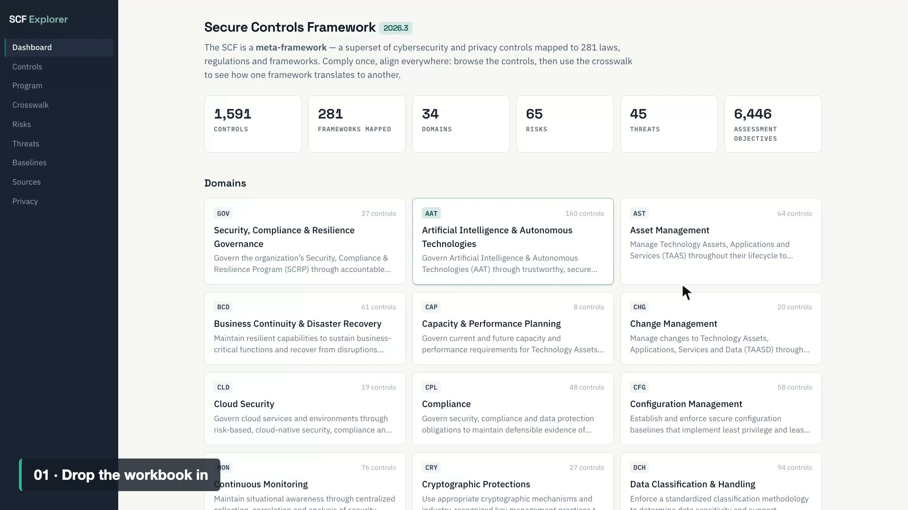

# SCF Explorer

[](https://github.com/MarkAC007/scf-explorer/actions/workflows/ci.yml)
[](https://scfcontrolsexplorer.app/)
[](LICENSE)
[](https://scfcontrolsexplorer.app/app/)
[](CONTRIBUTING.md)

A read-only, 100% client-side viewer for the [Secure Controls Framework](https://securecontrolsframework.com) (SCF). Upload the official SCF workbook and explore every control, framework mapping, maturity level, risk and threat — parsed in your browser, never uploaded anywhere.

## 👉 [scfcontrolsexplorer.app](https://scfcontrolsexplorer.app/)

Everything about what it does, how it works and how to use it lives on the site. The app itself is at **[scfcontrolsexplorer.app/app](https://scfcontrolsexplorer.app/app/)**.

[](https://scfcontrolsexplorer.app/#demo)

## Run it yourself

```bash
npm ci
npm run dev      # local dev server
npm run build    # static site in dist/ — host it anywhere
```

Development, testing and architecture notes: [CONTRIBUTING.md](CONTRIBUTING.md) and [CLAUDE.md](CLAUDE.md).
Vulnerabilities: report privately via [SECURITY.md](SECURITY.md).

## Licence & attribution

- Code: [MIT](LICENSE).
- The Secure Controls Framework is created and maintained by the [SCF Council](https://securecontrolsframework.com) under [CC BY-ND 4.0](https://creativecommons.org/licenses/by-nd/4.0/). SCF Explorer renders SCF content **exactly as published** and this repository ships **no SCF data** — you bring the official workbook; even the test suite fetches the unmodified official release at test time.
- **Not affiliated with or endorsed by the SCF Council.** An independent effort to help GRC practitioners get the most from the SCF.
